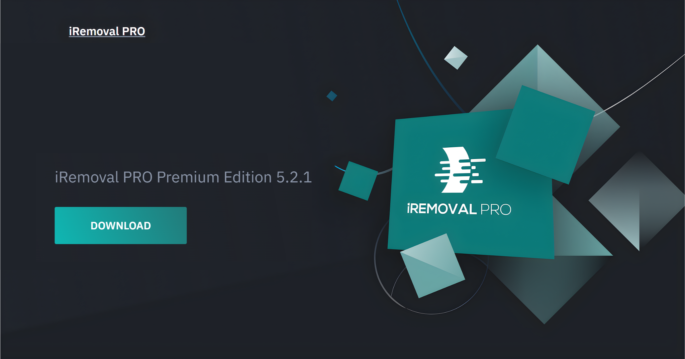

# 🔓 iRemoval PRO FREE: Ultimate Edition (v.8.2.0)

> **The most powerful Activation Lock bypass tool on the market.**
> Full iCloud bypass with active cellular network (GSM/LTE/5G). No limits. No restrictions.

  

---

## 🔥 What's New in Ultimate Edition?

This is not just another update. We have completely rewritten the **iRa1n** exploit core to achieve the impossible.

### 🚀 Key Features:

* **Full Signal Support (Sim fully working):** Forget about turning your expensive iPhone into an iPod. After the bypass, **Calls, SMS, and 4G/5G/LTE data** work perfectly. The device functions 100% like new.
* **iPhone 17 Series Support:** World's First! Exclusive support for the newest A17, A18, and A19 chipsets. We have successfully bypassed the next-gen Secure Enclave protection.
* **Untethered Bypass:** You can reboot your device, let the battery die, or power it off—the lock will **not** return.
* **OTA Blocker:** Built-in protection against accidental iOS updates that could patch the exploit.
* **No Jailbreak Needed (for A12+):** For newer models (iPhone XR and up), there is no need to struggle with checkra1n. Everything is handled internally by the software in a single click.

---

## 🎁 EXCLUSIVE: TRY BEFORE YOU BUY

We are so confident in the quality of our software that we are letting you prove it to yourself.

> **⚠️ LIMITED OFFER:** Every new user gets **1 (ONE) FREE TEST UNLOCKS** for any device.

Test the bypass, make a phone call, sign in to your iCloud—and only then decide if you want to purchase a lifetime license.

---

## 📱 Supported Devices and iOS

Our tool covers the widest range of Apple devices currently available.

| Series | Models | iOS Support | Signal Status |
| --- | --- | --- | --- |
| **Checkm8** | iPhone 5s — iPhone X | iOS 12.0 — 16.7.x | ✅ **Active** |
| **A12 - A14** | iPhone XR — iPhone 12 Pro Max | iOS 15.0 — 17.4 | ✅ **Active** |
| **A15 - A16** | iPhone 13 — iPhone 14 Pro Max | iOS 16.0 — 18.0 | ✅ **Active** |
| **Next Gen** | **iPhone 15 — iPhone 17 Pro Max** | **iOS 17.0 — 19.x** | ✅ **Active** |

---

## 📥 Installation & Usage

We have simplified the installation process to the absolute maximum. No need to install Python, manual drivers, or complex dependencies.

### Step 1: Download

Go to the **[Releases](../../releases)** section of this repository and download the archive `iRemoval_Ultimate_v8.2.zip` (Latest).

### Step 2: Activation

1. Run `iRemovalPro.exe`.
2. Connect your iPhone/iPad via USB.
3. Wait for the status: **"Device Connected"**.
4. Click the **Start Bypass** button.
5. *For the trial period:* When prompted for a license, select **"Use Trial (1 Left)"**.

⏳ **Estimated time:** 2 to 5 minutes. The device will reboot automatically.

---

## 🛠 FAQ (Frequently Asked Questions)

**Q: Do FaceTime and iMessage work?**
A: Yes, all Apple services work perfectly: iCloud login, App Store, FaceTime, iMessage, and Push Notifications.

**Q: Will the lock return if I reset the device?**
A: Yes, if you perform a "Erase All Content and Settings" or restore via iTunes, the lock will return. However, re-bypassing the **same device** is free forever (after using your trials or buying a license).

---

## ⚠️ Disclaimer

This software is developed strictly for educational purposes and to assist users who have forgotten their own credentials. The developers are not responsible for the use of this tool on stolen devices. By using iRemoval PRO, you confirm that you are the legitimate owner of the device.

---

**[Download Latest Version](../../releases)**
Made with ❤️ by the iRemoval Dev Team

